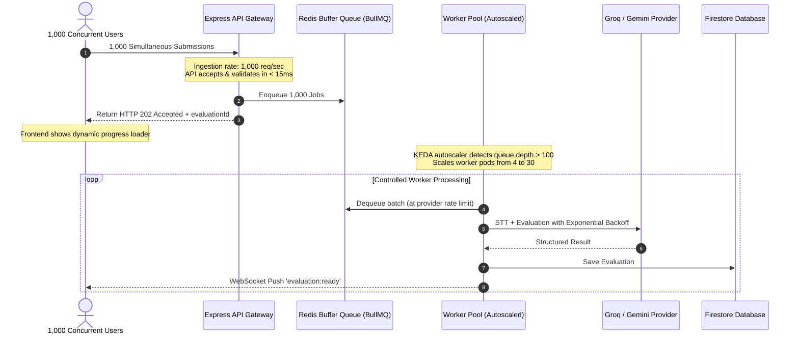

# ARCHITECTURE.md — SayWise System Architecture & Engineering Analysis

> **Executive Summary**: This document provides an industry-grade technical blueprint for the SayWise Speaking Evaluation System. It analyzes the architectural limitations of naive LLM integrations, specifies a decoupled production architecture capable of sustaining **10,000+ evaluations/day**, establishes resilience strategies for **1,000 simultaneous spike submissions**, details multi-tier cost optimizations, and proposes advanced backend engineering innovations.

---

## 1. Limitations of Directly Calling an LLM for Every Speaking Response

Many initial AI prototypes directly stream raw audio payloads into multimodal LLM endpoints (e.g., direct Gemini/GPT-4o audio endpoints) within a single synchronous HTTP request cycle. In a production environment, this monolithic pattern suffers from severe engineering limitations:

```
[Naive Approach - Monolithic & Fragile]
Client (Browser) ──(Raw Audio Upload)──> Monolithic Express API ──(Synchronous Audio Stream)──> Multimodal LLM
                                                   │                                                  │
                                          [Blocks HTTP Thread]                                [Takes 6-15 seconds]
                                                   │                                                  │
                                          [Client Timeout?] <─────────────────────────────────────────┘
```

### 1.1 Cost Inefficiency ($10\times$ to $20\times$ Overhead)
* **Audio Token Multiplier**: Multimodal LLM billing converts audio into dense temporal tokens (typically 25–50 tokens per second of audio). A 90-second voice response translates to ~3,000–4,500 input audio tokens per evaluation.
* **Text vs Multimodal Disparity**: Transcribing the same 90-second audio via a dedicated STT engine (like Groq Whisper Large v3 or Faster-Whisper) costs $\approx \$0.00018$ per minute. Feeding the resulting 150-word transcript into a high-speed LLM (Llama 3.3 70B / Gemini Flash) costs $\approx \$0.0001$ in text tokens.
* **Financial Impact**: A direct multimodal LLM approach costs $\approx \$0.02 - \$0.05$ per evaluation, whereas a decoupled **STT $\to$ Text LLM** pipeline costs $\approx \$0.001$ per evaluation—a **95% reduction in operational AI spend**.

### 1.2 API Rate Limits (RPM / TPM Saturation)
* AI providers enforce strict tier limits:
  * **Requests Per Minute (RPM)**: Free/Tier-1 limits are often 15–60 RPM.
  * **Tokens Per Minute (TPM)**: Audio tokens rapidly exhaust TPM pools.
* Under direct synchronous calling, a modest surge of 50 users simultaneously hitting "Submit" immediately triggers HTTP `429 Too Many Requests`, causing cascading failures for subsequent requests.

### 1.3 Latency & Performance Degradation
* Multimodal audio processing in monolithic LLMs exhibits high Time-To-First-Token (TTFT) and processing latency of **6 to 15 seconds**.
* Holding open synchronous HTTP connections on Node.js/Express for 15 seconds exhausts socket pools, causes reverse-proxy timeouts (e.g., Cloudflare 524 / Nginx 504), and drastically degrades user experience.

### 1.4 Scalability Bottlenecks & Resource Starvation
* Node.js is single-threaded (Event Loop). While I/O is non-blocking, buffering multiple in-memory audio payloads (10–30 MB each) directly in the API process causes memory spikes, V8 garbage collection thrashing, and process crashes (OOM errors).

### 1.5 Reliability & Error Handling
* **Lack of Retry Budgets**: Transient network drops between the backend and AI provider cause unrecoverable user-facing errors.
* **Non-Deterministic Failures**: If an LLM returns malformed JSON or hallucinates scoring rubrics during a live request, there is no isolation layer to retry with a fallback model or repair the output.

---

## 2. Production Architecture (10,000+ Evaluations / Day)

To reliably serve **10,000 evaluations per day** (~7 evaluations/minute average, peaking at 50–100 evaluations/minute during daytime study hours), SayWise adopts a **Decoupled Event-Driven Worker Pipeline**.

### 2.1 System Architecture Diagram

```mermaid
flowchart TD
    subgraph ClientLayer ["Client Layer (Browser / Mobile)"]
        UI["React 18 + TypeScript UI"]
        AudioRec["Web Audio MediaRecorder"]
        Waveform["Live Waveform Canvas"]
        UI --> AudioRec
        AudioRec --> Waveform
    end

    subgraph EdgeLayer ["Edge & Ingestion Layer"]
        CDN["Cloudflare CDN / DDoS Guard"]
        API["Express.js API Gateway (Node/TS)"]
        AuthMid["JWT / Google OAuth Middleware"]
        RateLimiter["Redis Token Bucket Rate Limiter"]
        CDN --> API
        API --> AuthMid
        API --> RateLimiter
    end

    subgraph StorageLayer ["Object & Metadata Storage"]
        GCS["Cloud Object Storage (S3 / GCS / Firebase)"]
        Firestore["Firestore / PostgreSQL (State & Reports)"]
    end

    subgraph QueueLayer ["Asynchronous Message Broker"]
        RedisQueue["BullMQ / Redis Job Queue"]
        DLQ["Dead-Letter Queue (DLQ)"]
        RedisQueue -.->|Exceeded 3 Retries| DLQ
    end

    subgraph WorkerPool ["Distributed Worker Cluster (K8s / Cloud Run)"]
        STTWorker["1. Speech-to-Text Worker (Groq Whisper v3 / Whisper.cpp)"]
        AcousticWorker["2. Acoustic Metrics Analyzer (WPM, Silence, Fillers)"]
        LLMWorker["3. AI Evaluator (Groq Llama 3.3 / Gemini Flash)"]
        SchemaValidator["4. JSON Schema Validator & Output Sanitizer"]
        STTWorker --> AcousticWorker
        AcousticWorker --> LLMWorker
        LLMWorker --> SchemaValidator
    end

    subgraph NotificationLayer ["Real-Time Push Delivery"]
        WS["WebSocket Server / SSE (Server-Sent Events)"]
        PollingFallback["HTTP Long-Polling Fallback"]
    end

    %% Flow connections
    AudioRec -->|1. Request Signed Upload URL| API
    API -->|2. Pre-signed PUT URL| AudioRec
    AudioRec -->|3. Direct Audio Upload| GCS
    AudioRec -->|4. Trigger Evaluation Job| API
    API -->|5. Push Job Payload (evaluationId, audioUrl)| RedisQueue
    API -->|6. Instant 202 Accepted| UI

    RedisQueue -->|7. Dequeue Job| STTWorker
    GCS -->|Fetch Audio Stream| STTWorker
    SchemaValidator -->|8. Persist Detailed Report| Firestore
    SchemaValidator -->|9. Publish Completed Event| WS
    WS -->|10. Push Live Report to Client| UI
    UI -.->|11. Fallback Query| PollingFallback
    PollingFallback -.-> Firestore
```

---

### 2.2 End-to-End Execution Lifecycle

#### Step 1: Audio Ingestion via Pre-Signed Direct Upload
* The client records audio using the **Browser MediaRecorder API** (audio/webm;codecs=opus or audio/wav).
* The client requests a **Pre-Signed Upload URL** from `/api/evaluations/presigned-url`.
* The client uploads the binary audio file directly to Cloud Storage (S3/GCS/Firebase Storage).
* **Engineering Benefit**: Audio binaries never pass through or clog the Express API server memory.

#### Step 2: Speech-to-Text (STT) Conversion
* The background worker fetches the audio file from storage and routes it to **Groq Whisper Large v3** (or local Faster-Whisper cluster).
* Transcription completes in **$< 400\text{ ms}$** with phonetic accuracy, punctuation, and word-level timestamps.

#### Step 3: Acoustic & Prosodic Feature Extraction
* The worker extracts acoustic features directly from audio metadata and word timestamps:
  * **Speaking Rate (WPM)**: $\text{Total Spoken Words} / \text{Active Speech Duration (Minutes)}$.
  * **Filler Word Count**: Detection of phonetic hesitation markers (`"um"`, `"uh"`, `"er"`, `"ah"`, `"like"`, `"you know"`).
  * **Pause Ratio**: Measures silence duration between utterance chunks.

#### Step 4: AI Evaluation with Structured JSON Schema
* The transcript, topic criteria, and acoustic metrics are passed into **Groq Llama 3.3 70B** (or Google Gemini 2.0 Flash) with an enforced deterministic JSON schema (`response_format: { type: "json_object" }`).
* Evaluates:
  1. **Overall Score (0–100)** and **CEFR Level (A1–C2)**.
  2. **Grammar Analysis**: Array of errors `{ errorText, correction, rule, category, explanation, startIndex, endIndex }`.
  3. **Vocabulary & Lexical Resource**: Variety score, CEFR distribution percentage, overused terms, advanced synonyms.
  4. **Actionable Suggestions**: Concrete drills targeting identified weak spots.

#### Step 5: Data Storage & Real-Time Delivery
* The validated evaluation report is written to **Firestore / PostgreSQL** under `evaluations/{evaluationId}`.
* The worker emits a `job:completed` event via **WebSockets (Socket.io) / Server-Sent Events (SSE)**.
* The frontend immediately transitions from the progress animation to the interactive report card.

---

## 3. Cost Optimization Strategies

To reduce operational costs from thousands of dollars per month to a fraction of a cent per evaluation:

| Strategy | Implementation Details | Savings Impact |
| :--- | :--- | :--- |
| **Decoupled STT vs Multimodal** | Transcribe via Groq Whisper v3 ($0.00018/min) then evaluate text via Llama 3.3 / Gemini Flash instead of direct multimodal audio tokens. | **~90% AI cost reduction** |
| **Deterministic Rule Pre-filter** | Use lightweight algorithmic tools (e.g. syllable counter for WPM, regex for filler words) before calling the LLM. | **~25% token savings** |
| **Prompt Optimization & Caching** | Compress system prompts, utilize strict few-shot formatting, and leverage Gemini Context Caching / Groq fast inference. | **~30% input token reduction** |
| **Semantic & Transcript Caching** | Hash normalized transcripts using Redis. If a student submits the exact same text or boilerplate response, serve cached evaluation. | **100% savings on duplicates** |
| **Tiered Model Routing** | Route basic practice sessions to ultra-light models (Llama 3.1 8B / Gemini Flash-Lite); route high-stakes mock exams to Llama 3.3 70B. | **~60% inference cost reduction** |
| **Rate Limiting & Tiered Quotas** | Redis Token Bucket limiting free users to $N$ evaluations/day, mitigating bot abuse. | **Prevents financial DoS** |

---

## 4. High-Reliability Architecture (1,000 Simultaneous Submissions)

When 1,000 users submit evaluations simultaneously (e.g., at the end of a scheduled classroom exam):



### 4.1 How No Requests Are Lost
1. **Asynchronous Decoupling**: The API gateway does not perform AI processing in the HTTP thread. It simply validates the token, writes the job to Redis, and returns `202 Accepted` in **$< 20\text{ ms}$**.
2. **Redis AOF Persistence**: Redis is configured with Append-Only File (`appendfsync everysec`) so in-flight jobs survive container restarts.
3. **Dead-Letter Queue (DLQ)**: If an AI call fails due to third-party outages, BullMQ retries 3 times with exponential backoff and jitter (`initialDelay: 1000ms`, `factor: 2`). Jobs that repeatedly fail move to a DLQ for automated recovery.

### 4.2 How Users Receive Their Results
* The frontend receives the `evaluationId` instantly and listens on a dedicated WebSocket room: `socket.join('eval:' + evaluationId)`.
* If the WebSocket connection drops, the frontend transparently falls back to an exponential polling interval (`/api/evaluations/:id/status` at 2s, 4s, 8s intervals).

### 4.3 How the Backend Remains Stable
* **Backpressure Management**: Workers consume jobs at a controlled concurrency limit matching the AI provider's maximum allowable RPM (e.g., 30 concurrent workers).
* **Horizontal Pod Autoscaling (KEDA / HPA)**: Kubernetes Event-driven Autoscaling monitors Redis queue depth (`queue_length > 50`) and spins up worker pods automatically.
* **Circuit Breakers**: A circuit breaker (Opossum) monitors AI provider error rates. If 5xx errors exceed 20%, it temporarily redirects traffic to a fallback provider (e.g., Groq $\to$ Gemini $\to$ Self-hosted Whisper/vLLM) without crashing the server.

---

## 5. Backend Engineering Roadmap & Next-Level Improvements

Beyond basic STT and text evaluation, an industry-leading speaking platform should implement:

1. **Phoneme-Level Pronunciation Scoring (CTC Forced Alignment)**:
   * Use Wav2Vec2 / Kaldi / MFA (Montreal Forced Aligner) to align the user's audio against expected phonetic phonemes (ARPAbet/IPA), scoring individual word pronunciation confidence (0–100%).
2. **Prosodic & Intonation Pitch Analysis**:
   * Extract Fundamental Frequency ($F_0$) pitch contours using Parselmouth/PRAAT to measure English sentence stress, rhythm, and monotone pitch flags.
3. **Real-Time Streaming Evaluation (WebRTC / WebSocket)**:
   * Stream live audio chunks every 250ms to provide continuous real-time transcription and instant grammar hints while the user is still speaking.
4. **Adaptive Spaced-Repetition Coaching**:
   * Maintain a personal "Mistake Vault" for each user in Firestore, automatically generating targeted speaking prompts that force the user to reuse words or grammar structures they previously failed.
5. **Multi-Accent Benchmark Calibration**:
   * Normalize scoring models across diverse global accents (Indian, East Asian, Hispanic, European English) to eliminate regional phonetic bias in grammar and vocabulary grading.
